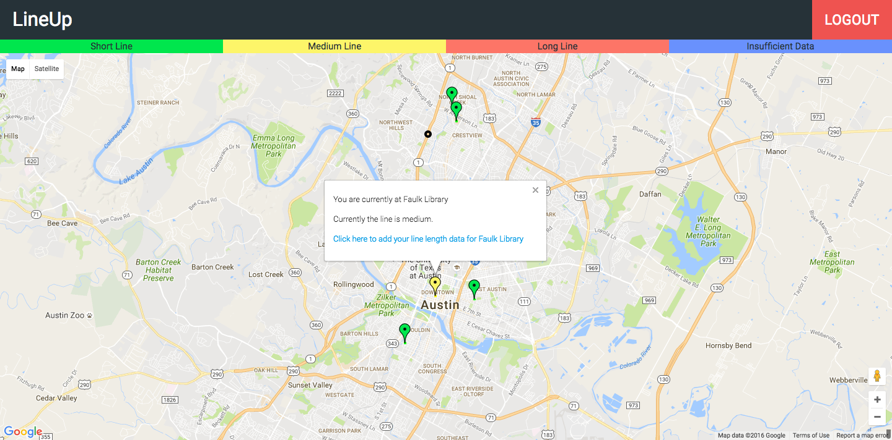

#LineUp
A web application that shows the length of lines at locations determined by user voting. LineUp allows users to give feedback on line length to update our data in real time with crowd sourced information.

## Installation
npm install package.json  
create MySQL database  
run these commands in terminal:  
sequelize db:migrate  
sequelize db:seed:all  
Go to http://localhost:3333 to run locally

## Live Demo
[Demo](https://pure-scrubland-81366.herokuapp.com/)

## Usage
Help potential voters see how long the lines are at voting locations around Travis County. Allow users to give our web application feedback on line length so we can update our data in real time with crowd sourced information.

## Contributing
1. Fork it!
2. Create your feature branch: `git checkout -b my-new-feature`
3. Commit your changes: `git commit -am 'Add some feature'`
4. Push to the branch: `git push origin my-new-feature`
5. Submit a pull request
